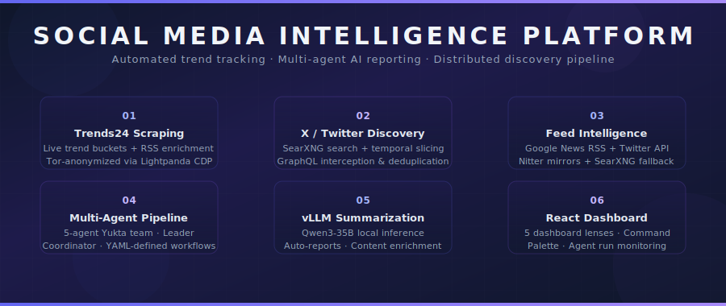

<p align="center">
  
</p>

# Social Media Intelligence Platform

An automated, multi-agent social media intelligence and news dashboard platform — scraping trends, discovering tweets, and generating professional HTML reports, powered by a custom AI agent framework.

---

## Table of Contents

- [Overview](#overview)
- [Features](#features)
- [Architecture](#architecture)
- [Quick Start](#quick-start)
- [Project Structure](#project-structure)
- [Components](#components)
  - [Trends24 Scraper](#trends24-scraper)
  - [Feed & Tweet Fetcher](#feed--tweet-fetcher)
  - [X (Twitter) Discovery Pipeline](#x-twitter-discovery-pipeline)
  - [Multi-Agent Report Generator](#multi-agent-report-generator)
  - [React Dashboard UI](#react-dashboard-ui)
  - [Yukta Agent Framework](#yukta-agent-framework)
- [Configuration](#configuration)
- [API Endpoints](#api-endpoints)
- [Infrastructure Services](#infrastructure-services)
- [Run Modes](#run-modes)
- [Development](#development)
- [License](#license)

---

## Overview

**Social Media Intelligence** is a production-grade, fully automated platform for tracking, discovering, and reporting on social media trends and news events. It layers anonymization (Tor), multi-source discovery (SearXNG + RSS + Trends24), AI-powered extraction (vLLM + Yukta agents), and a polished presentation layer (React dashboard + Tailwind HTML reports) into a single cohesive system.

Whether you need to monitor trending topics in real time, discover viral tweet URLs, or produce structured intelligence dashboards — this platform handles it all autonomously.

---

## Features

- **Automated Trend Scraping** — Live scraping of [Trends24.in](https://trends24.in) with timestamp extraction, location detection, and fallback enrichment via Google News & Trends RSS feeds.
- **Anonymized Traffic** — All scraping traffic routed through a **Tor** network, with **Lightpanda** headless browser providing a clean Chrome DevTools Protocol (CDP) interface.
- **Multi-Source Feed Discovery** — Fetches news articles and tweets from Google News RSS, Twitter API v2, Nitter RSS mirrors, and SearXNG search — with automatic fallback and rate limiting.
- **X/Twitter URL Intelligence Pipeline** — Advanced distributed system for discovering, prioritizing, deduplicating, and extracting tweet content using SearXNG search patterns, GraphQL interception, and Scrapy browser fetching.
- **AI-Powered Summarization** — Local LLM inference via vLLM (`qwen3-35b`) for automatic trend summarization, report generation, and content enrichment.
- **Multi-Agent Dashboard Builder** — A 5-agent hierarchical team (powered by the Yukta framework) that plans, researches, designs, and writes professional HTML dashboard reports autonomously.
- **Declarative Agent Ecosystem** — Agents, skills, tools, and teams defined in YAML with Markdown workflow files — fully extensible without code changes.
- **React Dashboard** — A rich single-page application with multiple "lenses" (HeroLens, DiscoverLens, FeedsLens, YuktaLens, SystemPulse), a command palette, settings panel, and live agent run monitoring.
- **Auto-Scheduler** — Background scheduler that automatically triggers agent sessions at configurable intervals.
- **REST API** — Comprehensive Flask API for all operations: scraping, discovery, feed fetching, agent runs, and report retrieval.

---

## Architecture

```
                    User / Trigger / Scheduler
                            |
                            v
                 +----------------------+
                 |     server.py        |  Flask REST API + UI proxy
                 |      Port 8080       |
                 +----------+-----------+
                            |
      +---------------------+----------------------+
      |                     |                      |
      v                     v                      v
  bot.py             tools-impl/*          agent_runtime/
  (Trends24)         (Tool Wrappers)       (Yukta Coordinator)
      |                     |                      |
      v                     v                      v
  Lightpanda        SearXNG / Twitter       Yukta Team:
  CDP :9222         API / RSS / Nitter      Master (LEAD)
      |              / Tor :9050             -> ActionPlanner (SENIOR)
  Tor Proxy                          -> Researcher (SENIOR)
  :9050                                -> DashboardBuilder (SENIOR)
                                         -> ReportWriter (SENIOR)
                                            |
                                            v
                                    data/runs/<id>/
                                    report.html
                                        |
                                        v
                                 React UI (iframe)
```

---

## Quick Start

### Prerequisites

- **Python 3.10+**
- **Node.js 18+** (for React UI)
- **Docker & Docker Compose** (for infrastructure services)

### 1. Start Infrastructure Services

```bash
docker compose up -d
```

This starts:
| Service | Image | Port | Purpose |
|---------|-------|------|---------|
| **Tor** | `dockurr/tor` | 9050 (SOCKS), 9051 (Control) | Anonymous traffic routing |
| **Lightpanda** | `lightpanda/browser:nightly` | 127.0.0.1:9222 | Headless browser (CDP) |
| **SearXNG** | `searxng/searxng:latest` | 0.0.0.0:8888 | Metasearch engine |

### 2. Install Python Dependencies

```bash
python3 -m venv .venv
source .venv/bin/activate
pip install --upgrade pip
pip install -r requirements.txt
playwright install chromium
```

### 3. Configure Environment

```bash
cp .env.example .env
# Edit .env with your vLLM endpoint and other settings
```

### 4. Run the Platform

```bash
# Start the Flask API + UI server
python server.py

# In a separate terminal, start the React UI (optional)
cd ui_react
npm install
npm run dev
```

Open **http://127.0.0.1:8080/** to access the dashboard.

### 5. Run the Trends24 Bot

```bash
# One-time run
python bot.py --run-once

# Continuous monitoring (every 300 seconds)
python bot.py --interval-sec 300
```

---

## Project Structure

```
socialmedia/
├── bot.py                        # Trends24 scraper + RSS enrichment + vLLM summarizer
├── server.py                     # Flask REST API + React UI proxy
├── docker-compose.yml            # Infrastructure services (Tor, Lightpanda, SearXNG)
├── requirements.txt              # Python dependencies
├── .env / .env.example           # Environment configuration
│
├── agent_runtime/                # Agent pipeline orchestration
│   ├── llm.py                    # vLLM client factory
│   ├── runtime.py                # run_news_session() — builds & runs team
│   ├── scheduler.py              # Background auto-trigger scheduler
│   └── tools_registry.py         # Tool wrappers for Yukta agents
│
├── ecosystem/                    # Declarative YAML agent ecosystem
│   ├── agents/                   # Agent definitions (YAML)
│   ├── teams/                    # Team definitions (YAML)
│   ├── tools/                    # Tool descriptors (YAML)
│   ├── tools-impl/               # Tool implementations (Python)
│   ├── skills/                   # SKILL.md workflow files
│   └── config/system.yaml        # System configuration
│
├── Experiments/                  # Proofs of concept & exploratory work
│   ├── poc_feeds/                # Feed fetcher POC
│   ├── torpanda/                 # Tor + Lightpanda tests
│   ├── tweetxtract/              # X content extraction experiments
│   └── X_fetch/                  # Full X/Twitter intelligence pipeline
│       ├── core/                 # Models, config, utilities
│       ├── tools/                # Discovery, feeds, browser, extraction tools
│       └── infrastructure/       # Docker, K8s, DB schemas
│
├── ui_react/                     # React dashboard (Vite + Tailwind)
│   ├── src/
│   │   ├── App.jsx               # Main app with NerveBar, Canvas, Palette
│   │   ├── components/           # Dashboard lenses, shared components
│   │   ├── hooks/                # React hooks for API integration
│   │   └── utils/api.js          # API client functions
│   └── vite.config.js            # Vite config with API proxy
│
├── yukta/                        # Yukta v2.1.0 — Custom AI Agent Framework
│   ├── core/                     # Agent, Chat, Memory, Storage
│   ├── api/                      # Coordinator, Orchestrator, Loader, Validator
│   ├── tools/                    # ToolProcessor, Sandbox, MCP
│   └── instrumentation/          # OpenTelemetry tracing
│
├── searxng/                      # SearXNG metasearch engine source
├── searxng-config/               # Custom SearXNG settings
├── config/                       # Tor configuration (torrc)
├── data/                         # Output directory
│   ├── latest_snapshot.json      # Latest Trends24 snapshot
│   ├── latest_report.md          # Latest markdown report
│   ├── latest_dashboard.html     # Latest HTML dashboard
│   └── runs/<run_id>/            # Individual agent run outputs
│
└── Assets/                       # Branding & banner images
    └── reporter.jpg              # Reporter asset image
```

---

## Components

### Trends24 Scraper (`bot.py`)

Automatically collects trending topics from Trends24.in using Playwright connected to a Lightpanda browser via CDP. Features:

- **Location-aware scraping** — Reads the selected location and captures trend buckets with timestamps
- **RSS enrichment** — Augments Trends24 data with Google News RSS and Google Trends RSS (India)
- **vLLM summarization** — Generates event summaries using a local Qwen3 model
- **Fallback pipeline** — If Trends24 is unavailable, derives trending hashtags from RSS titles
- **Persistent output** — Writes `latest_snapshot.json` and `latest_report.md` to `data/`

### Feed & Tweet Fetcher (`Experiments/poc_feeds/`)

Fetches news articles and tweets for any hashtag across multiple sources:

- **Google News RSS** — Real-time news articles per hashtag
- **Twitter API v2** — Direct tweet fetching (with bearer token)
- **Nitter RSS mirrors** — Fallback Twitter data via Nitter instances (`nitter.net`, `nitter.privacyredirect.com`, etc.)
- **SearXNG search** — General web search fallback
- **Built-in rate limiting** — Configurable delays between requests

### X (Twitter) Discovery Pipeline (`Experiments/X_fetch/`)

A distributed system for discovering and ingesting X/Twitter posts at scale:

| Tool | Purpose |
|------|---------|
| **Discovery** | SearXNG-based URL discovery with temporal slicing and multi-engine search |
| **Prioritization** | Scoring algorithm to rank discovered tweet URLs by relevance |
| **Deduplication** | MD5 content hashing to eliminate duplicate findings |
| **Browser Fetch** | Scrapy + Lightpanda browser fetching with network interception |
| **GraphQL** | GraphQL response interception for deep data extraction |
| **Session Identity** | Tor proxy rotation + browser fingerprint management |
| **Extraction** | Normalization of raw GraphQL data into structured models |
| **Persistence** | Storage to PostgreSQL and ElasticSearch |
| **Monitoring** | Prometheus metrics and telemetry |

### Multi-Agent Report Generator (`agent_runtime/` + `ecosystem/`)

A 5-agent hierarchical team orchestrated by Yukta's `LeaderCoordinator`:

```
┌──────────────────────────────────────────────────────────┐
│                     Master News Director                  │
│                        (LEAD level)                       │
│  Orchestrates the pipeline through structured rounds      │
├──────┬───────┬───────────┬──────────────────┬────────────┤
│      │       │           │                  │            │
│      v       v           v                  v            v
│  Action    Researcher   Layout          Report         Output
│  Planner   (All tools  Builder          Writer         HTML
│           + Terminal)  (12-col grid)    (Tailwind +    Dashboard
│                                     Chart.js)          Report
└──────────────────────────────────────────────────────────┘
```

Each agent follows a `SKILL.md` workflow defining its process. The pipeline runs in 4–6 structured rounds.

### React Dashboard UI (`ui_react/`)

A rich, single-page dashboard built with React, Vite, Tailwind CSS, and Framer Motion:

| Lens | Purpose |
|------|---------|
| **HeroLens** | Display latest reports with agent run metadata |
| **DiscoverLens** | X/Twitter URL discovery results and monitoring |
| **FeedsLens** | Hashtag-based feed fetching with trend data |
| **YuktaLens** | Agent run management — create, monitor, review |
| **SystemPulse** | System health monitoring and status overview |

Additional features: **Command Palette** (quick actions), **Settings Panel** (configuration), and **NerveBar** (top navigation/status).

### Yukta Agent Framework (`yukta/`)

A custom-built, modular AI agent framework featuring:

- **Hierarchical Teams** — `LeaderCoordinator` for structured, round-based agent teams
- **Group Chat Sessions** — `GroupChatSession` for flat, open-ended collaboration
- **6 LLM Clients** — Ollama, vLLM, HuggingFace, LM Studio, SGLang, and Remote/OpenAI-compatible
- **Persistent Memory** — Memory with automatic overflow archiving to disk
- **Tool System** — Sandboxed tool execution, MCP support, and declarative YAML descriptors
- **OpenTelemetry Tracing** — Full instrumentation and observability

---

## Configuration

Environment variables are managed through `.env` (copied from `.env.example`):

| Variable | Default | Description |
|----------|---------|-------------|
| `LIGHTPANDA_CDP_URL` | `http://127.0.0.1:9222` | Lightpanda browser CDP endpoint |
| `VLLM_BASE_URL` | `http://192.168.200.23:11642/v1` | vLLM inference endpoint |
| `VLLM_MODEL` | `qwen3-35b` | Model name for vLLM |
| `POLL_INTERVAL_SEC` | `300` | Bot polling interval (seconds) |
| `SEARXNG_HOST` | `0.0.0.0` | SearXNG bind address |
| `SEARXNG_PORT` | `8080` | SearXNG internal port |
| `SEARXNG_SECRET_KEY` | `change_me_...` | SearXNG encryption secret |

Bot CLI options:
- `--run-once` — Execute a single scrape cycle
- `--interval-sec N` — Run continuously every N seconds
- `--disable-llm` — Skip vLLM summarization

---

## API Endpoints

| Method | Endpoint | Description |
|--------|----------|-------------|
| **GET** | `/api/snapshot` | Latest Trends24 snapshot (JSON) |
| **GET** | `/api/report` | Latest markdown report |
| **GET** | `/api/fetch?country=&city=` | On-demand Trends24 scrape |
| **GET** | `/api/feeds?tags=` | Fetch feeds for hashtags |
| **GET** | `/api/discover?keywords=` | X/Twitter URL discovery |
| **POST** | `/api/agent/run` | Kick off Yukta agent session |
| **GET** | `/api/agent/status/<run_id>` | Monitor agent run progress |
| **GET** | `/api/agent/result/<run_id>` | Get final HTML report |
| **GET** | `/api/runs` | List all generated runs |
| **GET** | `/api/runs/<id>/html` | Get HTML for a specific run |
| **GET** | `/api/runs/<id>/history` | Get run history |
| **GET** | `/api/dashboard/latest` | Serve latest generated dashboard |
| **GET** | `/api/agent/scheduler` | Check scheduler state |

---

## Infrastructure Services

All infrastructure services are containerized via Docker Compose:

```bash
docker compose up -d    # Start all services
docker compose down      # Stop all services
docker compose ps        # Check service status
```

Each service is connected to the `scrape-net` bridge network for internal communication.

---

## Run Modes

The platform supports several operational modes:

1. **Standalone Bot** — Run `bot.py` independently for Trends24 scraping and RSS enrichment
2. **Agent Pipeline** — Trigger Yukta agents via `POST /api/agent/run` or the auto-scheduler
3. **Full Platform** — Run `server.py` + React UI for the complete dashboard experience
4. **X Intelligence** — Run `X_fetch` pipeline independently for Twitter discovery and ingestion

---

## Development

### Yukta Agent Framework

The Yukta framework can be extended by adding new agents, skills, tools, and teams to the `ecosystem/` directory. All definitions are declarative (YAML + Markdown) — no framework code changes needed.

```bash
# Test Yukta CLI
cd yukta
pip install -e .
yukta --help
```

### React UI

```bash
cd ui_react
npm run build      # Production build
npm run dev        # Development server (port 8081)
```

### X Fetch Pipeline

```bash
cd Experiments/X_fetch
pip install -r requirements.txt
# Follow infrastructure/ setup for Docker/Kubernetes deployment
```

---

## License

This project is a social media intelligence platform for automated trend tracking, tweet discovery, and AI-powered dashboard reporting.

---

<p align="center">
  
</p>

<p align="center" style="margin-top:24px;">
  <strong><a href="#table-of-contents">Back to top ↑</a></strong>
</p>
