# Yukta Package Architecture

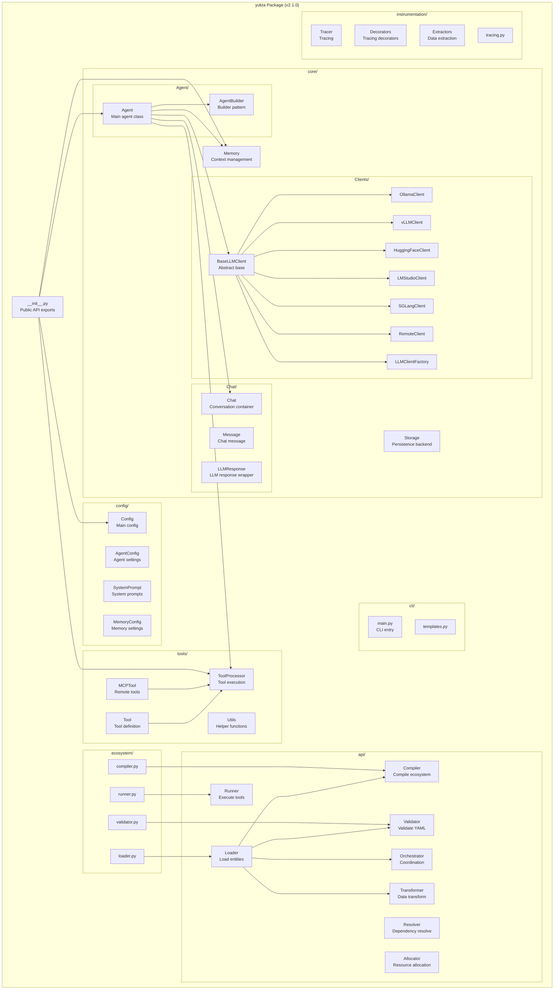

---

## Hierarchical Structure

```mermaid
graph TD
    Yukta[Yukta v2.1.0<br/>Modular AI Agent Framework]
    
    PublicAPI[Public API<br/>__init__.py exports]
    
    subgraph "Core Runtime"
        AgentCore[Agent System]
        MemoryCore[Memory System]
        ChatCore[Chat System]
        ClientCore[LLM Clients]
        StorageCore[Storage Backends]
    end
    
    subgraph "Configuration"
        AgentConfig[AgentConfig]
        SystemPrompt[SystemPrompt]
        MemoryConfig[MemoryConfig]
        Config[Config]
    end
    
    subgraph "Tools System"
        ToolDef[Tool Definitions]
        ToolProc[Tool Processor]
        MCPTools[MCP Tools]
    end
    
    subgraph "Ecosystem"
        EcoAPI[Ecosystem API]
        EcoLoader[Ecosystem Loader]
        EcoCompiler[Ecosystem Compiler]
        EcoValidator[Ecosystem Validator]
    end
    
    subgraph "CLI"
        CLI[Command Line Interface]
    end
    
    subgraph "Instrumentation"
        Tracing[Tracing/Observability]
        Decorators[Decorators]
        Extractors[Attribute Extractors]
    end
    
    Yukta --> PublicAPI
    PublicAPI --> AgentCore
    PublicAPI --> MemoryCore
    PublicAPI --> ChatCore
    PublicAPI --> ClientCore
    PublicAPI --> ToolProc
    PublicAPI --> Config
    PublicAPI --> EcoAPI
    
    AgentCore --> AgentConfig
    AgentCore --> SystemPrompt
    AgentCore --> MemoryCore
    AgentCore --> ToolProc
    AgentCore --> ClientCore
    
    MemoryCore --> MemoryConfig
    MemoryCore --> StorageCore
    
    ClientCore --> Ollama[Ollama]
    ClientCore --> VLLM[vLLM]
    ClientCore --> HF[HuggingFace]
    ClientCore --> LMStudio[LM Studio]
    ClientCore --> SGLang[SGLang]
    
    ToolProc --> ToolDef
    ToolProc --> MCPTools
    
    EcoAPI --> EcoLoader
    EcoAPI --> EcoCompiler
    EcoAPI --> EcoValidator
    
    AgentCore -.-> Tracing
    MemoryCore -.-> Tracing
```

---

## Package Structure

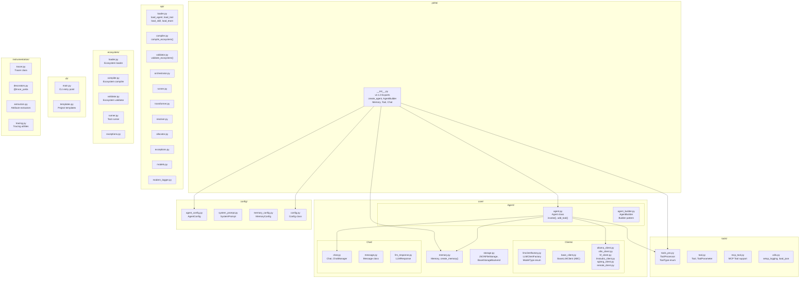

---

## Class Relationships

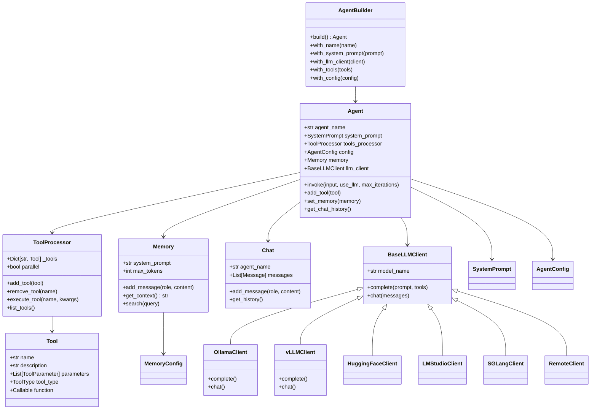

---

## Data Flow

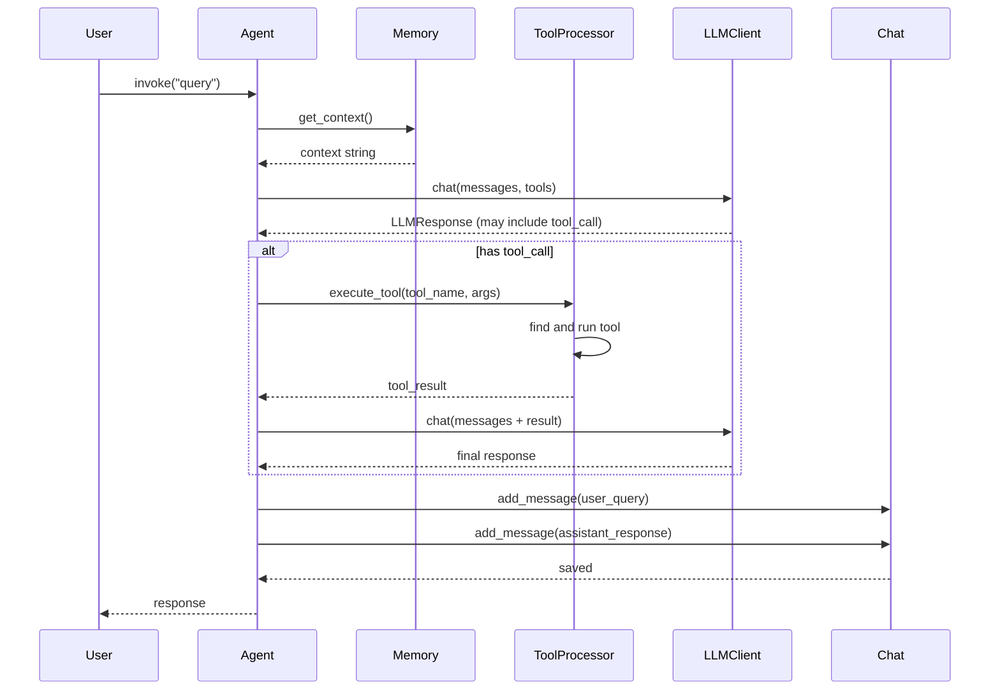

---

## LLM Client Architecture

```mermaid
graph LR
    subgraph "LLM Client Factory"
        factory[LLMClientFactory<br/>create_client()]
    end
    
    subgraph "Base"
        base[BaseLLMClient<br/>(Abstract)]
    end
    
    subgraph "Implementations"
        Ollama[OllamaClient]
        VLLM[vLLMClient]
        HF[HuggingFaceClient]
        LMStudio[LMStudioClient]
        SGLang[SGLangClient]
        Remote[RemoteClient]
    end
    
    factory --> base
    base --> Ollama
    base --> VLLM
    base --> HF
    base --> LMStudio
    base --> SGLang
    base --> Remote
```

---

## Tool Processing Flow

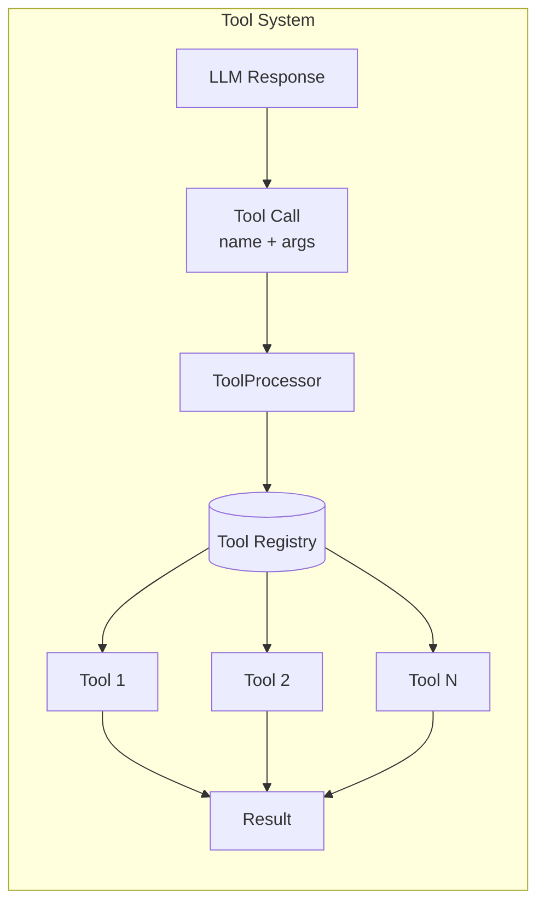

---

## Ecosystem Architecture

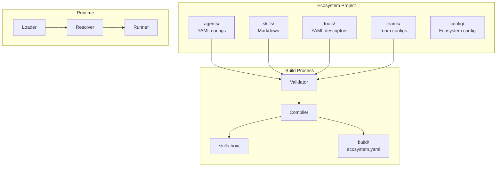

---

# Yukta vs Other AI Agent Frameworks

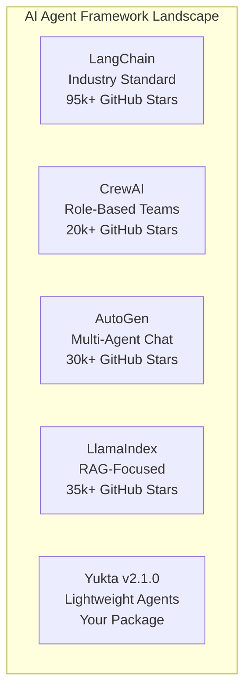

---

## Comparison Overview

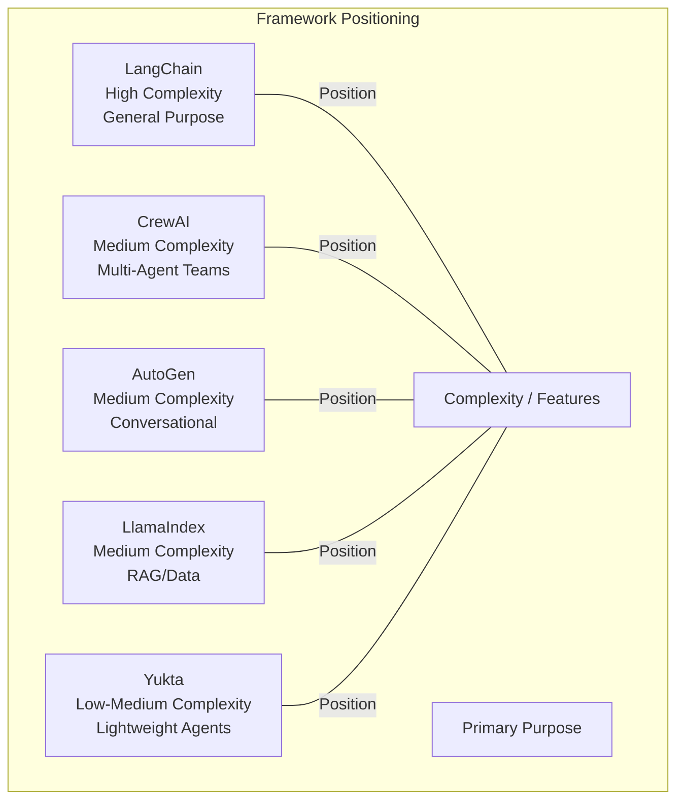

---

## Feature Comparison Table

```mermaid
classDiagram
    class Framework {
        +str name
        +int stars
        +str primary_focus
        +int integrations
        +str learning_curve
        +bool production_ready
    }
    
    class Yukta {
        +name = "Yukta"
        +stars = "Your Package"
        +primary_focus = "Lightweight modular agents"
        +integrations = "6 LLM clients"
        +learning_curve = "Low"
        +production_ready = "Yes"
    }
    
    class LangChain {
        +name = "LangChain"
        +stars = "95k+"
        +primary_focus = "LLM integration & chains"
        +integrations = "500+"
        +learning_curve = "High"
        +production_ready = "Yes"
    }
    
    class CrewAI {
        +name = "CrewAI"
        +stars = "20k+"
        +primary_focus = "Role-based multi-agent"
        +integrations = "~50"
        +learning_curve = "Low"
        +production_ready = "Growing"
    }
    
    class AutoGen {
        +name = "AutoGen"
        +stars = "30k+"
        +primary_focus = "Multi-agent collaboration"
        +integrations = "~30"
        +learning_curve = "Medium"
        +production_ready = "Research-grade"
    }
    
    class LlamaIndex {
        +name = "LlamaIndex"
        +stars = "35k+"
        +primary_focus = "RAG & data integration"
        +integrations = "100+"
        +learning_curve = "Medium"
        +production_ready = "Yes"
    }
```

---

## Detailed Comparison Matrix

| Feature | Yukta | LangChain | CrewAI | AutoGen | LlamaIndex |
|---------|-------|-----------|--------|---------|------------|
| **Version** | v2.1.0 | Latest | Latest | Latest | Latest |
| **GitHub Stars** | - | 95k+ | 20k+ | 30k+ | 35k+ |
| **LLM Clients** | 6 (local + remote) | 100+ | Via LiteLLM | Multiple | Multiple |
| **Multi-Agent** | Via ecosystem | Via LangGraph | Native | Native | No |
| **Tool Support** | Custom + MCP | 500+ tools | Custom | Function calling | Via tools |
| **Memory** | Built-in | Multiple options | Built-in | Chat history | Via data |
| **RAG** | Via tools | Built-in | Via tools | Via tools | Native |
| **Observability** | OpenTelemetry | LangSmith | Limited | Basic | Limited |
| **CLI** | Yes | LangServe | No | No | No |
| **Code Execution** | Via tools | Via tools | Via tools | Built-in | Via tools |
| **Python Only** | Yes | No (JS/TS) | Yes | Yes | No (TS) |
| **Learning Curve** | Low | High | Low | Medium | Medium |
| **Production Ready** | Yes | Yes | Growing | Research | Yes |

---

## Architecture Comparison

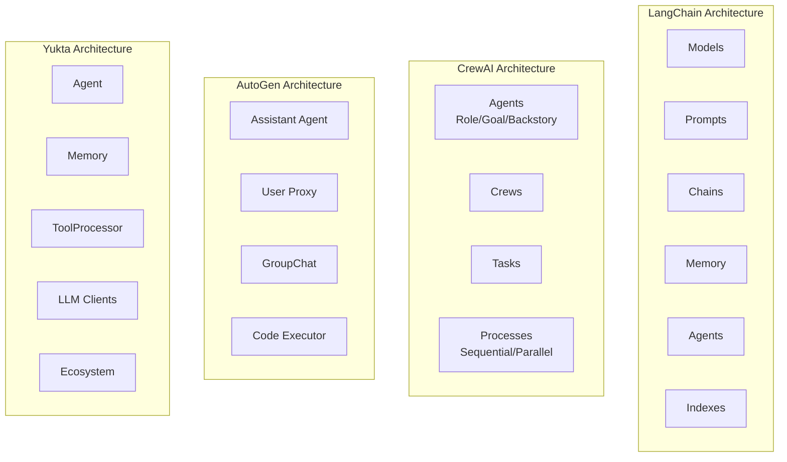

---

## When to Choose Yukta

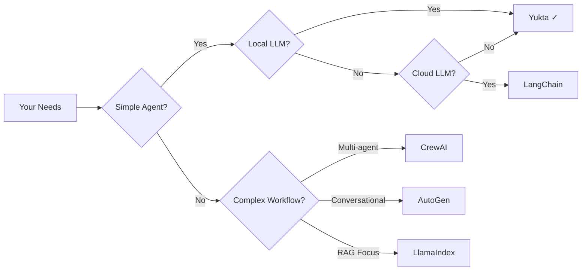

### Choose Yukta When:

- ✅ You need a **lightweight** agent framework
- ✅ You prefer **local LLMs** (Ollama, vLLM, LM Studio)
- ✅ You want **built-in memory** without external dependencies
- ✅ You need **CLI ecosystem** for YAML-based agent management
- ✅ You want **simple API** like `create_agent()` and `invoke()`
- ✅ You need **tool processing** with MCP support

### Choose LangChain When:

- ✅ You need **500+ integrations** with external services
- ✅ You want **LangGraph** for complex workflow orchestration
- ✅ You need **LangSmith** for production observability
- ✅ You're building **enterprise RAG** systems

### Choose CrewAI When:

- ✅ Your workflow maps to **role-based teams**
- ✅ You want **fast prototyping** with minimal code
- ✅ You need **task delegation** between agents

### Choose AutoGen When:

- ✅ You need **multi-agent conversation** dynamics
- ✅ You want **built-in code execution**
- ✅ You're building **research prototypes**

### Choose LlamaIndex When:

- ✅ Your primary focus is **RAG pipelines**
- ✅ You need **advanced retrieval** strategies
- ✅ You're building **knowledge base** systems

---

## Yukta Strengths vs Competitors

```mermaid
radarChart
    title "Framework Feature Comparison"
    axes "LLM Flexibility", "Tool Support", "Memory", "Multi-Agent", "Simplicity", "CLI"
    
    "Yukta": [5, 4, 5, 3, 5, 5]
    "LangChain": [5, 5, 4, 4, 3, 3]
    "CrewAI": [3, 3, 3, 5, 4, 2]
    "AutoGen": [3, 3, 3, 5, 3, 2]
    "LlamaIndex": [3, 3, 2, 2, 3, 2]
```

### Yukta's Unique Advantages:

1. **Lightweight & Fast**
   - No heavy dependencies
   - Simple setup: `pip install yukta`
   - Minimal boilerplate code

2. **Local LLM Focus**
   - Native support for Ollama, vLLM, LM Studio, SGLang
   - Easy deployment without cloud API keys
   - Privacy-first architecture

3. **Built-in Memory**
   - Token-based context management
   - No external vector DB required
   - Simple JSON persistence

4. **CLI Ecosystem**
   - `yukta init ecosystem`
   - `yukta validate`
   - `yukta tool run`
   - YAML-based agent definitions

5. **Tool Processing**
   - Custom tool registration
   - MCP (Model Context Protocol) support
   - Parallel tool execution

---

## Code Comparison

### Yukta - Simple & Direct
```python
from yukta import create_agent

agent = create_agent(
    name="Assistant",
    system_prompt="You are helpful."
)
response = agent.invoke("Hello")
```

### LangChain - More Verbose
```python
from langchain_openai import ChatOpenAI
from langchain.agents import AgentExecutor, create_openai_functions_agent
from langchain.prompts import ChatPromptTemplate

# More setup required
```

### CrewAI - Role-Based
```python
from crewai import Agent, Task, Crew

researcher = Agent(role="Researcher", goal="Research", backstory="...")
task = Task(description="Research AI", agent=researcher)
crew = Crew(agents=[researcher], tasks=[task])
```

---

## Ecosystem Comparison

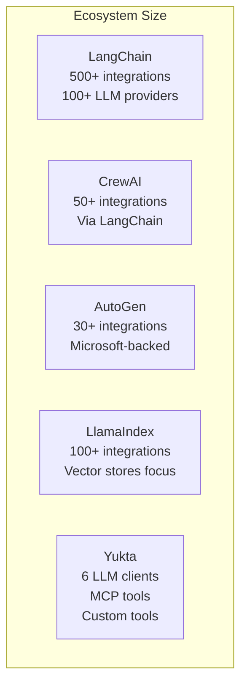

---

## Summary Table

| Module | Components | Purpose |
|--------|------------|---------|
| **core/Agent** | Agent, AgentBuilder | Main agent with invoke(), tools, memory |
| **core/Clients** | 6 implementations | Ollama, vLLM, HF, LM Studio, SGLang, Remote |
| **core/Memory** | Memory, MemoryConfig | Context management with token limits |
| **core/Chat** | Chat, ChatManager, Message | Conversation persistence |
| **core/Storage** | JSONFileStorage, BaseStorageBackend | Persistence layer |
| **tools/** | ToolProcessor, Tool, MCPTool | Tool definitions and execution |
| **config/** | AgentConfig, SystemPrompt, Config | Configuration management |
| **api/** | Loader, Compiler, Validator, Runner | Ecosystem integration |
| **ecosystem/** | Legacy ecosystem modules | Backward compatibility |
| **cli/** | main.py, templates.py | Command-line interface |
| **instrumentation/** | Tracer, Decorators, Extractors | OpenTelemetry observability |

---

## Verdict

Yukta occupies a unique position in the AI agent framework landscape:

- **Smaller & lighter** than LangChain
- **Simpler API** than CrewAI/AutoGen
- **Local LLM focused** (unlike cloud-first frameworks)
- **Built-in memory** (unlike LlamaIndex which needs external setup)
- **CLI included** (unique among these frameworks)

Yukta is ideal for:
- Developers wanting a **minimal dependency** agent framework
- Projects using **local LLMs** (Ollama, vLLM, etc.)
- Teams needing **quick prototyping** with memory
- Applications requiring **CLI-based ecosystem** management