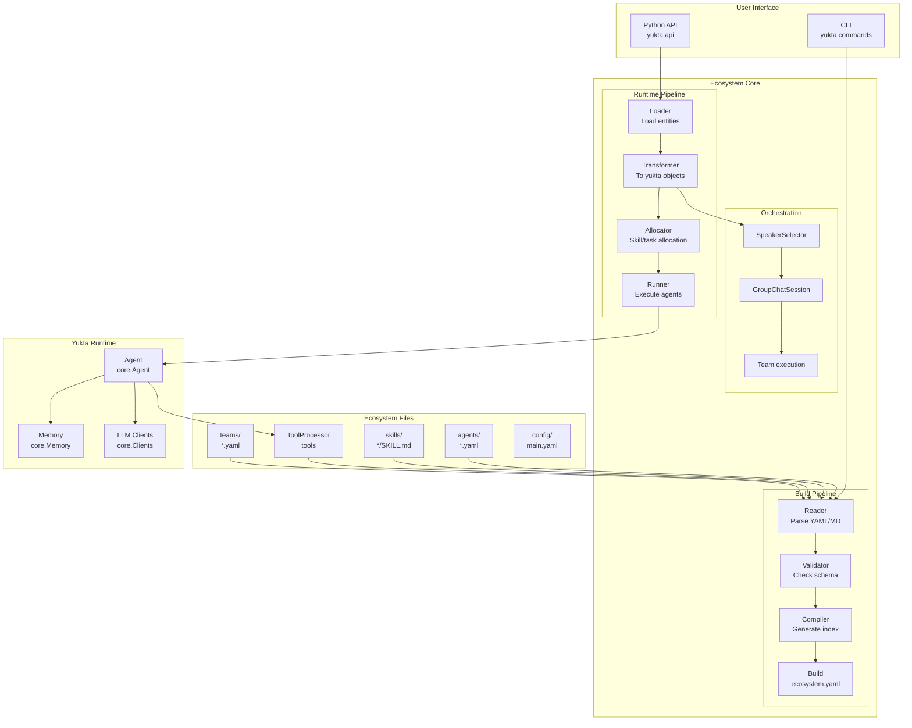
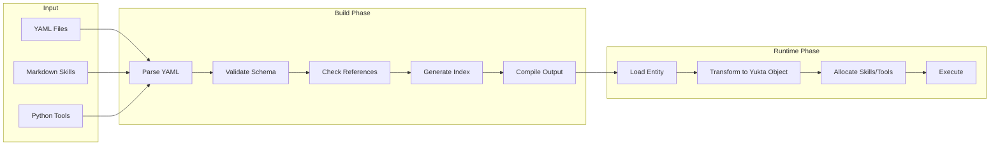
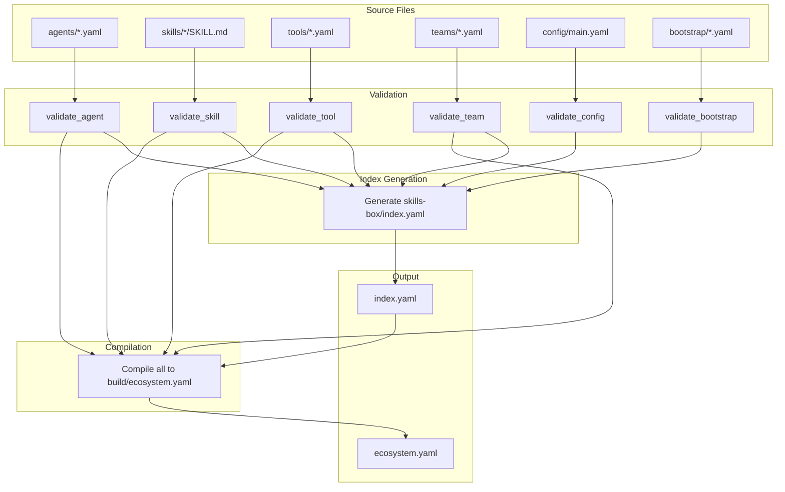
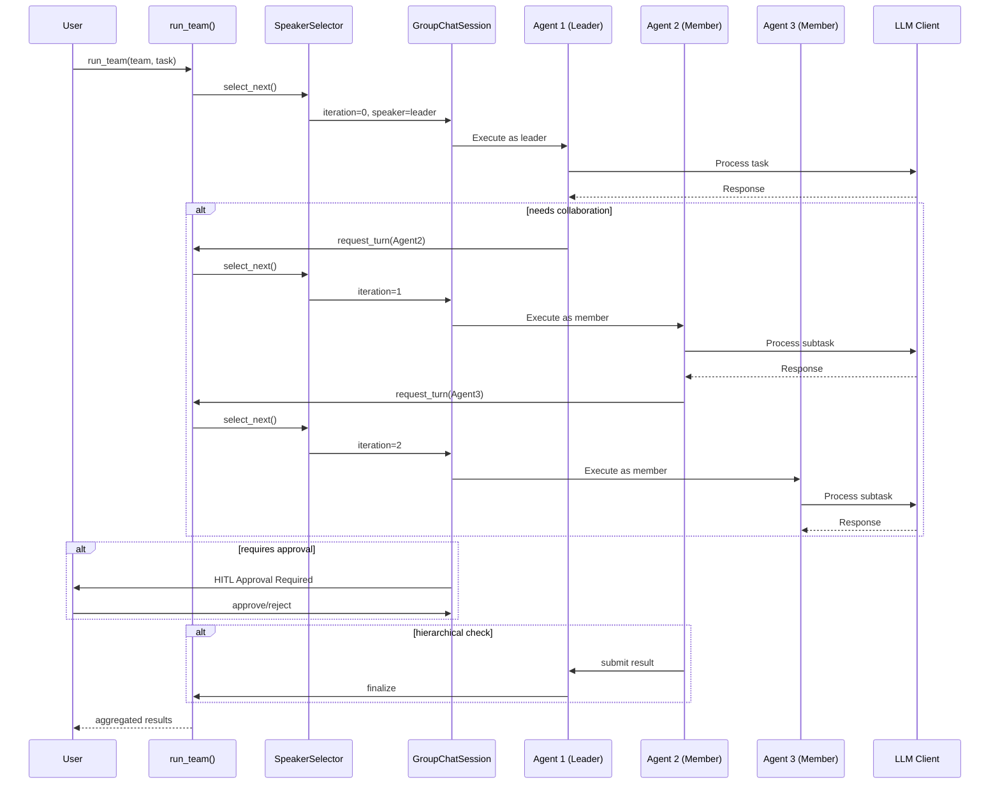
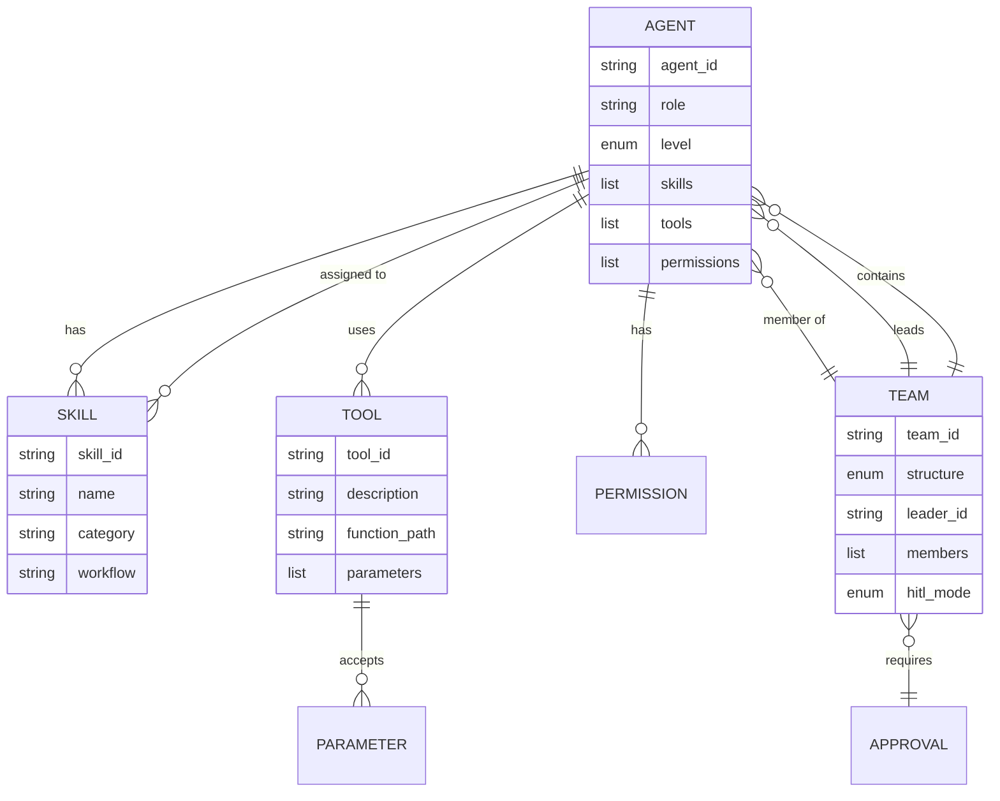
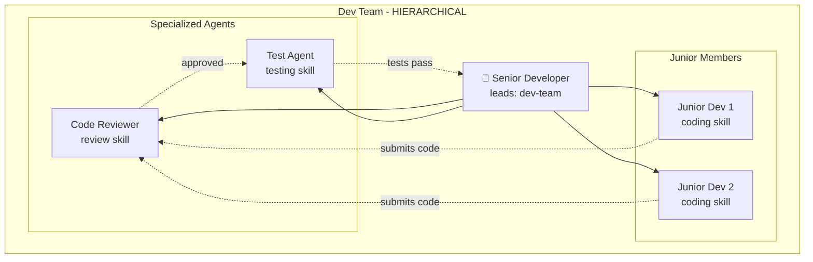
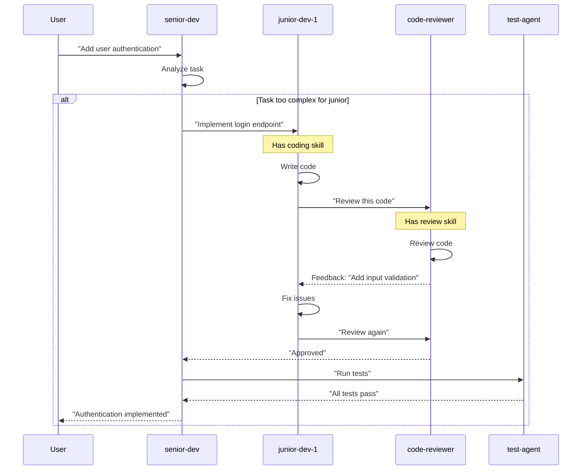
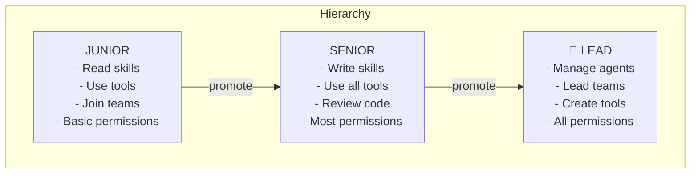
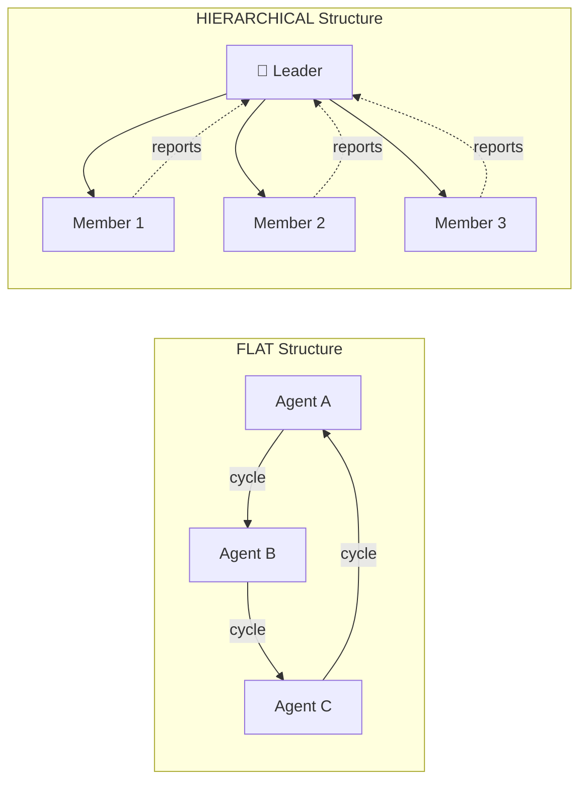

# Yukta Ecosystem Documentation

> Complete guide to the Yukta ecosystem system for declarative, scalable AI agent management.

---

## Table of Contents

1. [Ecosystem Overview](#ecosystem-overview)
2. [Architecture Diagrams](#architecture-diagrams)
3. [Project Structure](#project-structure)
4. [CLI Commands](#cli-commands)
5. [Entity Specifications](#entity-specifications)
6. [Example: AI Development Team](#example-ai-development-team)
7. [Permissions & Roles Hierarchy](#permissions--roles-hierarchy)
8. [Python API Reference](#python-api-reference)
9. [Direct vs Ecosystem Comparison](#direct-vs-ecosystem-comparison)
10. [Deprecated Module Note](#deprecated-module-note)

---

## Ecosystem Overview

### What is the Yukta Ecosystem?

The Yukta ecosystem is a **declarative framework** for managing AI agents, skills, tools, and teams through YAML configuration files. It provides:

- **Centralized Configuration**: All agent definitions in YAML files
- **Skill Workflows**: Markdown-based skill definitions with YAML frontmatter
- **Tool Registry**: Declarative tool definitions with Python implementations
- **Team Orchestration**: Multi-agent collaboration with hierarchy and permissions
- **Build Pipeline**: Compile ecosystem into single deployable YAML

### Why Use Ecosystem?

| Aspect | Direct Agent | Ecosystem |
|--------|-------------|-----------|
| **Setup** | Quick for single agent | Requires initialization |
| **Scaling** | Manual per-agent | Declarative, automated |
| **Teams** | Manual orchestration | Built-in hierarchy |
| **Skills** | Code-based | Markdown workflows |
| **Tools** | Programmatic | Declarative registry |
| **Validation** | None | Built-in validation |
| **CI/CD** | Hard to version control | Git-friendly YAML |

### Use Cases

- **Development Teams**: Multiple agents with defined roles (developer, reviewer, tester)
- **Enterprise Workflows**: Hierarchical approval processes with permissions
- **Skill Libraries**: Reusable skill definitions shared across agents
- **Tool Registries**: Centralized tool definitions with implementation separation

---

## Architecture Diagrams

### High-Level System Architecture



### Data Flow Pipeline



### Build Process



### Team Orchestration Flow



### Entity Relationships



---

## Project Structure

### Directory Layout

```
my-ecosystem/
├── agents/                    # Agent configurations (YAML)
│   ├── README.md
│   ├── developer.yaml
│   ├── reviewer.yaml
│   └── tester.yaml
│
├── skills/                    # Skill definitions (Markdown + YAML frontmatter)
│   ├── README.md
│   ├── coding/
│   │   └── SKILL.md
│   ├── testing/
│   │   └── SKILL.md
│   └── review/
│       └── SKILL.md
│
├── tools/                     # Tool descriptors (YAML)
│   ├── README.md
│   ├── file-editor.yaml
│   ├── terminal.yaml
│   └── git.yaml
│
├── tools-impl/               # Tool implementations (Python)
│   ├── __init__.py
│   └── tool_impl.py
│
├── teams/                    # Team configurations (YAML)
│   ├── README.md
│   └── dev-team.yaml
│
├── config/                  # System configuration
│   └── main.yaml
│
├── bootstrap/               # Bootstrap configurations
│   └── using-yukta.yaml
│
├── skills-box/              # Auto-generated index
│   └── index.yaml
│
└── build/                   # Compiled ecosystem
    └── ecosystem.yaml
```

### File Descriptions

| Directory | File Type | Purpose |
|-----------|-----------|---------|
| `agents/` | `.yaml` | Agent definitions with skills, tools, permissions |
| `skills/` | `SKILL.md` | Markdown workflows with YAML frontmatter |
| `tools/` | `.yaml` | Tool descriptors with function paths |
| `tools-impl/` | `.py` | Python implementations for tools |
| `teams/` | `.yaml` | Team definitions with structure and members |
| `config/` | `main.yaml` | Global ecosystem configuration |
| `bootstrap/` | `.yaml` | Bootstrap settings for initialization |
| `skills-box/` | `index.yaml` | Auto-generated registry of all entities |
| `build/` | `ecosystem.yaml` | Compiled single-file ecosystem |

---

## CLI Commands

### Initialize Ecosystem

```bash
yukta init ecosystem myproject
```

Creates a new ecosystem project with the following structure:

```
myproject/
├── agents/agent.yaml
├── skills/skill-name/SKILL.md
├── tools/tool.yaml
├── tools-impl/tool_impl.py
├── teams/team.yaml
├── config/main.yaml
├── bootstrap/using-yukta.yaml
├── skills-box/index.yaml
└── build/
```

### Validate Ecosystem

```bash
yukta validate ecosystem ./myproject
```

Performs:
1. Validates all YAML files against schemas
2. Checks agent/skill/tool references
3. Generates skills-box index
4. Compiles to build/ecosystem.yaml

### Run Tool

```bash
# Basic usage
yukta tool run mytool --path ./myproject

# With parameters
yukta tool run mytool --path ./myproject --param key=value
```

---

## Entity Specifications

### Agent Configuration

**Location**: `agents/{agent_id}.yaml`

```yaml
agent_id: developer
role: Developer
level: junior | senior | lead
version: "1.0.0"

# Skills this agent can use
skills:
  - coding
  - debugging

# Tools available to this agent
tools:
  - file-editor
  - terminal
  - git

# Permissions for this agent
permissions:
  - skill-read
  - tool-use
  - agent-read
  - team-join

# Behaviors/traits for this agent
behaviors:
  - helpful
  - methodical

# Optional: team memberships
team_memberships:
  - dev-team

# Optional: teams this agent leads (LEAD level only)
team_leads:
  - junior-team
```

### Skill Configuration

**Location**: `skills/{skill_id}/SKILL.md`

```yaml
---
name: coding
description: "Write clean, efficient code"
version: "1.0.0"
category: process
---

# Coding Skill

## Overview
This skill guides the agent through systematic coding practices.

## When to Use
- Writing new functionality
- Refactoring existing code
- Bug fixes

## The Process

### Step 1: Understand Requirements
- Read specification
- Ask clarifying questions
- Plan approach

### Step 2: Implementation
- Write clean code
- Follow conventions
- Add comments

### Step 3: Self-Review
- Check for edge cases
- Verify tests pass
- Review for improvements

## Checklist
- [ ] Requirements understood
- [ ] Implementation complete
- [ ] Tests added
- [ ] Self-review done
```

### Tool Configuration

**Location**: `tools/{tool_id}.yaml`

```yaml
tool_id: file-editor
description: "Read and write files in the workspace"
function_path: myproject.tools_impl.tool_impl:file_editor

parameters:
  - name: operation
    type: string
    required: true
    enum: [read, write, append, delete]
    description: "The file operation to perform"
    
  - name: path
    type: string
    required: true
    description: "Path to the file"
    
  - name: content
    type: string
    required: false
    description: "Content to write (for write/append)"
```

### Team Configuration

**Location**: `teams/{team_id}.yaml`

```yaml
team_id: dev-team
name: Development Team
structure: hierarchical  # flat | hierarchical
version: "1.0.0"

leader_id: senior-dev

members:
  - junior-dev-1
  - junior-dev-2
  - code-review-agent

# Human-in-the-loop settings
hitl:
  mode: optional  # none | optional | required
  approvers:
    - user-1
  timeout: 300

# Permissions for team
permissions:
  - team-execute
  - skill-share

# Context shared among members
context: |
  This team works on the main application.
  All code must pass review before merging.
```

### Configuration

**Location**: `config/main.yaml`

```yaml
version: "1.0.0"
name: my-ecosystem
description: "My AI development ecosystem"

system:
  default_llm: ollama
  model_name: mistral
  api_base: http://localhost:11434
  
  max_retries: 3
  timeout: 30

logging:
  level: INFO
  format: json
  
storage:
  type: json
  path: ./storage
  
ecosystem:
  auto_validate: true
  strict_mode: false
```

### Bootstrap Configuration

**Location**: `bootstrap/using-yukta.yaml`

```yaml
bootstrap_id: using-yukta
version: "1.0.0"
description: "Bootstrap configuration for Yukta"

agents:
  default:
    system_prompt: "You are a helpful AI assistant."
    config:
      log_level: INFO
      enable_logging: true
      auto_save_chat: true

skills:
  auto_load: true
  
tools:
  auto_load: true
  search_path:
    - tools-impl
```

---

## Example: AI Development Team

### Team Structure



### YAML Definitions

#### senior-dev.yaml (Lead Agent)

```yaml
agent_id: senior-dev
role: Senior Developer
level: lead
version: "1.0.0"

skills:
  - coding
  - architecture
  - code-review
  - testing

tools:
  - file-editor
  - terminal
  - git
  - code-analysis

permissions:
  - skill-read
  - skill-write
  - tool-use
  - tool-create
  - agent-read
  - agent-manage
  - team-join
  - team-lead
  - team-create

behaviors:
  - methodical
  - mentor
  - quality-focused

team_leads:
  - dev-team

team_memberships:
  - dev-team
```

#### junior-dev-1.yaml (Junior Agent)

```yaml
agent_id: junior-dev-1
role: Junior Developer
level: junior
version: "1.0.0"

skills:
  - coding
  - debugging

tools:
  - file-editor
  - terminal

permissions:
  - skill-read
  - tool-use
  - agent-read
  - team-join

behaviors:
  - eager-to-learn
  - thorough

team_memberships:
  - dev-team
```

#### code-reviewer.yaml (Specialized Agent)

```yaml
agent_id: code-reviewer
role: Code Reviewer
level: senior
version: "1.0.0"

skills:
  - code-review
  - security-scan
  - best-practices

tools:
  - file-editor
  - code-analysis
  - security-scan

permissions:
  - skill-read
  - tool-use
  - agent-read

behaviors:
  - critical-thinker
  - thorough

team_memberships:
  - dev-team
```

#### dev-team.yaml (Team Configuration)

```yaml
team_id: dev-team
name: Development Team
structure: hierarchical
version: "1.0.0"

leader_id: senior-dev

members:
  - junior-dev-1
  - junior-dev-2
  - code-reviewer
  - test-agent

hitl:
  mode: optional
  approvers:
    - tech-lead

permissions:
  - team-execute
  - skill-share
  - code-approve

context: |
  This team handles all development tasks.
  Code must pass review before merging to main.
  Tests must achieve 80% coverage.
```

### Workflow Example



---

## Permissions & Roles Hierarchy

### Agent Levels



### Permission Types

| Permission | Description | Level Required |
|------------|-------------|----------------|
| `skill-read` | Read skill definitions | junior |
| `skill-write` | Create/modify skills | senior |
| `tool-use` | Use registered tools | junior |
| `tool-create` | Create new tools | senior |
| `agent-read` | Read other agent configs | junior |
| `agent-manage` | Modify other agents | lead |
| `team-join` | Join teams | junior |
| `team-create` | Create new teams | lead |
| `team-lead` | Lead a team | senior |
| `team-execute` | Execute team tasks | member |

### Team Structures



### HITL (Human-in-the-Loop) Modes

| Mode | Description | Use Case |
|------|-------------|----------|
| `none` | No approval needed | Fully autonomous |
| `optional` | Approval if requested | Most tasks |
| `required` | Always require approval | Production releases |

---

## Python API Reference

### Loading Ecosystem Entities

```python
from yukta.api import (
    load_agent,
    load_skill,
    load_tool,
    load_team,
    list_agents,
    list_skills,
    list_tools,
    list_teams,
    load_ecosystem,
)

# Load an agent
agent = load_agent("developer", "./myproject")

# List all agents
agents = list_agents("./myproject")

# Load entire ecosystem
ecosystem = load_ecosystem("./myproject")
```

### Reading & Validation

```python
from yukta.api import (
    read_agent_yaml,
    read_skill_md,
    read_tool_yaml,
    read_team_yaml,
    validate_ecosystem,
    validate_agent,
    validate_tool,
    validate_skill,
    validate_team,
)

# Read individual files
agent_data = read_agent_yaml("./myproject/agents/developer.yaml")
skill_data = read_skill_md("./myproject/skills/coding/SKILL.md")

# Validate ecosystem
errors = validate_ecosystem("./myproject")
```

### Transformation

```python
from yukta.api import (
    transform_agent,
    transform_tool,
    transform_tools_processor,
    transform_bootstrap,
)

# Transform to Yukta objects
yukta_agent = transform_agent(agent_data, llm_client)
tools_processor = transform_tools_processor(tool_data_list)
```

### Running Agents

```python
from yukta.api import (
    run_agent,
    run_agent_with_task,
    build_and_run_agent,
)

# Run agent with a message
result = run_agent(agent, "Write a function to add numbers")

# Build and run in one step
result = build_and_run_agent(
    agent_id="developer",
    ecosystem="./myproject",
    llm_client=ollama_client,
    user_message="Create a new API endpoint"
)
```

### Team Orchestration

```python
from yukta.api import (
    run_team,
    GroupChatSession,
    SpeakerSelector,
)

# Run a team with a task
result = run_team(
    team_id="dev-team",
    ecosystem="./myproject",
    llm_client=ollama_client,
    task="Implement user authentication"
)

# Custom group chat session
session = GroupChatSession(
    team_data=team_data,
    structure=TeamStructure.HIERARCHICAL
)

while not session.is_complete():
    speaker = SpeakerSelector.select_next(team, session)
    agent = load_agent(speaker, ecosystem_path)
    response = run_agent(agent, session.current_message)
    session.add_response(speaker, response)
```

### Compilation & Indexing

```python
from yukta.api import (
    compile_ecosystem,
    generate_index,
)

# Generate skills-box index
generate_index(Path("./myproject"))

# Compile entire ecosystem
compile_ecosystem(Path("./myproject"), output_path=Path("./myproject/build/ecosystem.yaml"))
```

### Modern Logger

```python
from yukta.api import (
    setup_logging,
    get_logger,
    info,
    error,
    log_event,
    generate_event_banner,
)

# Setup colored logging
setup_logging(level=logging.INFO)

# Use logger
logger = get_logger("my_module")
logger.info("Agent started")

# Or use convenience functions
info("Task completed")
error("Something failed")
```

---

## Direct vs Ecosystem Comparison

### Direct Agent Usage

```python
from yukta import create_agent, AgentConfig
from yukta.core.Clients.ollama_client import OllamaClient
from yukta.tools import ToolProcessor

# Create LLM client
client = OllamaClient(model_name="mistral")

# Create agent programmatically
agent = create_agent(
    name="Developer",
    system_prompt="You are a helpful developer.",
    llm_client=client,
    config=AgentConfig(log_level=logging.INFO)
)

# Add tools manually
processor = ToolProcessor()
processor.add_tool(file_editor_tool)
agent.tools_processor = processor

# Invoke directly
response = agent.invoke("Write a hello world function")
```

### Ecosystem Usage

```yaml
# agents/developer.yaml
agent_id: developer
role: Developer
level: junior
skills:
  - coding
tools:
  - file-editor
permissions:
  - skill-read
  - tool-use
```

```python
from yukta.api import load_agent, run_agent
from yukta.core.Clients.ollama_client import OllamaClient

# Load agent from ecosystem
agent = load_agent("developer", "./myproject")

# Configure client
client = OllamaClient(model_name="mistral")
agent.set_llm_client(client)

# Run via ecosystem runner
result = run_agent(agent, "Write a hello world function")

# Or use build_and_run_agent
result = build_and_run_agent(
    agent_id="developer",
    ecosystem="./myproject",
    llm_client=client,
    user_message="Write a hello world function"
)
```

### Comparison Table

| Aspect | Direct | Ecosystem |
|--------|--------|-----------|
| **Setup Time** | Quick | Initial setup required |
| **Configuration** | Python code | YAML files |
| **Version Control** | Hard to track | Git-friendly |
| **Reusability** | Copy-paste | Import by name |
| **Skills** | Hard-coded | Markdown workflows |
| **Tools** | Register manually | Declarative registry |
| **Teams** | Custom orchestration | Built-in support |
| **Validation** | None | Schema validation |
| **CI/CD** | Manual | Automated |

### When to Use Each

| Scenario | Recommended Approach |
|----------|---------------------|
| Quick prototype, single agent | Direct |
| Production, multiple agents | Ecosystem |
| Team collaboration on agent configs | Ecosystem |
| Simple task automation | Direct |
| Complex multi-agent workflows | Ecosystem |
| Need skill libraries | Ecosystem |

---

## Deprecated Module Note

### Migration from `yukta.ecosystem`

The `yukta.ecosystem` module is **deprecated** as of v2.1.0. Please use `yukta.api` instead.

#### Old Import (Deprecated)
```python
from yukta.ecosystem import load_agent, validate_ecosystem

# ⚠️ Shows deprecation warning
agent = load_agent("developer", "./myproject")
```

#### New Import (Recommended)
```python
from yukta.api import load_agent, validate_ecosystem

# ✅ Using new module
agent = load_agent("developer", "./myproject")
```

#### Migration Table

| Old (deprecated) | New (recommended) |
|------------------|------------------|
| `yukta.ecosystem.load_agent` | `yukta.api.load_agent` |
| `yukta.ecosystem.load_skill` | `yukta.api.load_skill` |
| `yukta.ecosystem.load_tool` | `yukta.api.load_tool` |
| `yukta.ecosystem.load_team` | `yukta.api.load_team` |
| `yukta.ecosystem.validate_ecosystem` | `yukta.api.validate_ecosystem` |
| `yukta.ecosystem.compile_ecosystem` | `yukta.api.compile_ecosystem` |
| `yukta.ecosystem.run_tool` | `yukta.api.run_tool` |

#### Compatibility

The old module still works but emits deprecation warnings. It will be removed in a future version. All functionality has been migrated to `yukta.api` with improved features:

- Better error handling
- Modern logging
- Team orchestration
- Skill allocation
- Group chat sessions

---

## Quick Reference

### CLI Commands

```bash
# Initialize ecosystem
yukta init ecosystem myproject

# Validate ecosystem
yukta validate ecosystem ./myproject

# Run tool
yukta tool run mytool --path ./myproject --param key=value
```

### Key Imports

```python
from yukta.api import (
    # Loading
    load_agent, load_skill, load_tool, load_team,
    list_agents, list_skills, list_tools, list_teams,
    
    # Reading
    read_agent_yaml, read_skill_md, read_tool_yaml,
    
    # Validation
    validate_ecosystem, validate_agent, validate_tool,
    
    # Transformation
    transform_agent, transform_tools_processor,
    
    # Execution
    run_agent, run_team, build_and_run_agent,
    
    # Compilation
    compile_ecosystem, generate_index,
)
```

### Entity File Locations

| Entity | Location Pattern |
|--------|------------------|
| Agent | `agents/{agent_id}.yaml` |
| Skill | `skills/{skill_id}/SKILL.md` |
| Tool | `tools/{tool_id}.yaml` |
| Team | `teams/{team_id}.yaml` |
| Config | `config/main.yaml` |
| Bootstrap | `bootstrap/{id}.yaml` |

---

*Last Updated: May 2026*
*Version: 2.1.0*